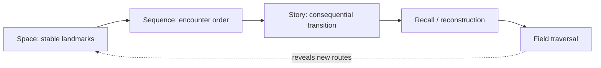

# Space → Sequence → Story

**Status:** Constellation / exploratory

## Ingredients

- A human mnemonic practice: imagining a familiar place and encountering remembered items at stable locations along a route.
- The [Field Traversal & Illumination](../../patterns/field-traversal-and-illumination.md) model: awareness is position-relative and traversal can disclose previously unseen structure.
- The [Witness shelf](../../witness/README.md): stored material is not automatically active context; retrieval is deliberate.
- GitBook as a navigable projection whose page order, grouping, and cross-links can provide persistent landmarks.
- Narrative memory: sequence and causal story often make disconnected items easier to reconstruct than an unordered list.

## The human observation

A familiar mnemonic technique is to place things to remember into an imagined spatial environment and mentally walk through it later. The useful part for this scrapbook is not a claim about exactly how all memory works. It is the practical observation that **stable location plus encounter order can make recall dramatically easier for a person**.

A house is especially good because it already has structure:

```text
front door
    ↓
hallway
    ↓
kitchen
    ↓
living room
    ↓
stairs
    ↓
bedroom
```

The remembered list no longer has to carry all of its own order. The space carries some of it.

Then story adds another layer:

```text
place
  + encounter
  + consequence
  = memorable route
```

The item is not merely *at coordinate 4*. Something happens there.

## Resonances

### Space may externalize part of retrieval

If concepts have stable conceptual places, the remembering intelligence may not need to reconstruct every relation from scratch.

The route itself becomes a retrieval aid.

That suggests a possible distinction:

```text
stored object
≠
reachable object
≠
object encountered along this route
```

### Sequence may encode more than order

A route through a space gives an ordered sequence without requiring an arbitrary numbered list.

But sequence can also preserve **transformation**:

```text
enter with question A
    ↓
encounter evidence B
    ↓
notice tension C
    ↓
pass through metaphor D
    ↓
arrive at possible primitive E
```

That is closer to reconstructing thought than merely retrieving documents.

### Story may make traversal causal

A story connects encounters by consequence rather than proximity alone.

For collective memory, this could mean a route remembers not only:

> A links to B.

but:

> Encountering A made B salient because this particular tension became visible.

That begins to resemble a [TraversalReceipt](../../patterns/field-traversal-and-illumination.md).

## Tensions

### Human spatial memory is not automatically a software architecture

A mnemonic palace is an observation about human recall practice. It does not establish that an AI or collective knowledge system should literally imitate neural spatial representation.

The software analogy must earn its usefulness separately.

### Stable places can become cages

A good memory palace relies on stable landmarks. A living knowledge system changes.

If every concept has exactly one permanent room, the architecture may hide the fact that one concept can participate in many fields.

A better model may therefore need:

```text
stable landmark
+
multiple routes through it
```

rather than one object → one location.

### Story can fabricate coherence

Narrative is powerful partly because it smooths discontinuity.

That is dangerous in an epistemic system. A satisfying path can make weak evidence feel inevitable.

Any story-like traversal must preserve:

- where the evidence actually ends
- which transition was analogy or inference
- which alternatives were available
- what remained fogged

## Possible traversal



A possible memory primitive appears:

> **A remembered route is an ordered traversal through stable-enough landmarks whose transitions preserve why the next encounter became reachable.**

That is intentionally weaker than claiming that memory *is* spatial.

## Illumination

This arrangement makes a new possibility visible for the GitBook experiment:

**Information architecture may itself be part of memory.**

If the same pages are presented in two structures—one taxonomic and one route-shaped—the content is identical while the retrieval experience differs.

That gives us a rare chance to test the idea without custom software.

### Small GitBook specimen

Compare two ways of presenting the same material.

**Control: taxonomy**

```text
patterns
notes
witness
specimens
glossary
```

**Experiment: route**

```text
Projection Is Witness
    ↓
Memory Is Terrain
    ↓
Space → Sequence → Story
    ↓
Two Kinds of Evidence
    ↓
Authority Narrows as Proof Grows
```

After traversal, ask whether a reader can reconstruct:

1. the major landmarks
2. why the order mattered
3. what transition connected each landmark
4. which uncertainties remained unresolved

The test is not merely whether the route feels nicer. The route should improve **reconstruction**.

## Residual fog

- How much of the mnemonic benefit comes from spatial imagery specifically versus any stable ordered schema?
- Does a reader develop a durable internal map of a GitBook site after repeated use?
- Should field locations be globally stable, observer-specific, or route-specific?
- Can one concept occupy many remembered places without generating confusion?
- Does narrative sequencing improve retrieval while increasing the risk of false inevitability?
- What is the smallest representation of a route that preserves sequence without overfitting the reader?

## Promotion routes

This constellation should not become a pattern until a specimen compares at least two navigational structures over substantially the same content.

A useful proof would show that stable landmarks + meaningful encounter sequence improve later reconstruction while preserving provenance and uncertainty.

If that holds, likely graduation targets include:

- a portable **spatial traversal** pattern in this notebook
- a TranchNode representation for route-addressed field traversal
- a Corpus OS interface for reconstructing a case or trust topology as a bounded route
- GitBook navigation conventions for the Static Collective Field Guide

Until then:

> Space is a powerful clue, not yet a law.
