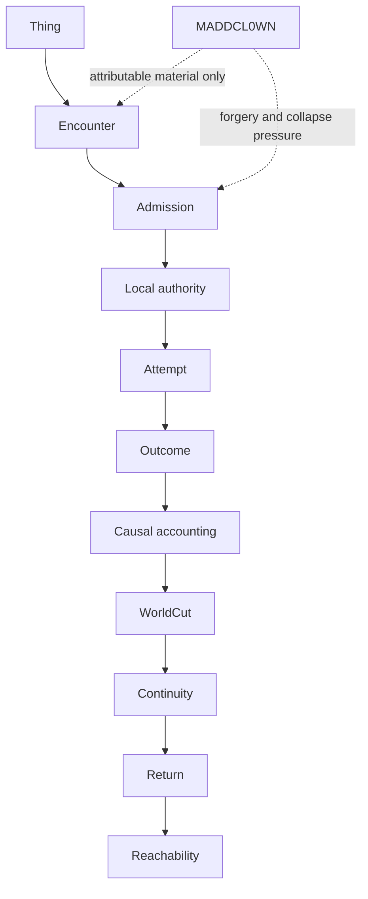

# Full Bowl 001 × MADDCL0WN

## Verdict

**The chain survives, with two exposed witness-surface leaks and no authority merger.**

One synthetic thing crossed ten explicit boundaries. The lawful path completed. Invented authority was refused. Missing subject identity stayed indeterminate. An uncategorized hostile object remained an orphan observation. A visible return did not erase changed causal history. The real specimen remained distinguishable from a visible lookalike under the declared recognition purpose.

MADDCL0WN did not become an authority at any crossing.

Two leaks were observed and recorded without repair:

1. a shape-valid but detached encounter ref can reach Corpus admission and be repeated in `evidenceRefs`;
2. the Corpus stdio result compresses admission, local authority, attempt, and outcome into one externally visible disposition.

The smallest repair issues are open as [integration issue #54](https://github.com/the-static-collective/What-is-the-static-collective-/issues/54) and [Corpus OS issue #32](https://github.com/the-static-collective/corpus-os/issues/32). No repair is included in this specimen.

## The bowl



The arrows are boundaries, not synonyms. A value on the left does not silently become the value on the right.

## Task World Cut

The run is bounded to issues [#43](https://github.com/the-static-collective/What-is-the-static-collective-/issues/43) and [#44](https://github.com/the-static-collective/What-is-the-static-collective-/issues/44), plus these exact owner heads:

| Owner | Pinned head |
| --- | --- |
| Integration / GitBook source | `3d35990f2c084ae5b402e3e348d2da7ee33b4a3c` |
| Project0 | `061b9a6e1c9314f7fb43dbb0026059211ed19f0d` |
| Corpus OS | `1f3344b5f3f46d28ff6dda901d9c14620641b6ca` |
| TranchNode | `91f7f96805d4e868e35b8d0c75dc5f0671cb494a` |

Included surfaces:

* Project0 encounter addressing and exact verification;
* Corpus OS encounter admission;
* Corpus OS WorldCut, continuity attestation, and latent reachability;
* TranchNode continuity boundary witness;
* Project0 purpose-relative continuity closure.

Explicitly omitted:

* universal schema;
* shared or merged runtime;
* portable authority;
* automatic repair;
* Full Measure DDD;
* production deployment, analytics, geography, research, and private data surfaces.

The GitBook Front Room oriented the traversal. Current project sources and executable owner surfaces remain authoritative for the claims below.

## The one tiny thing

The specimen is **Black Glass Seed 001**, represented at the Corpus boundary by the existing synthetic subject `artifact:agreement-a`.

| Dimension | Before | After return |
| --- | --- | --- |
| visible state | `visible:full-bowl-001:sealed` | `visible:full-bowl-001:sealed` |
| history | `history:full-bowl-001:before` | `history:full-bowl-001:after` |
| custody witness | `custody:project0` | `custody:corpus-os` |
| portable authority | none | none |

The command is deliberately tiny:

> `BLACK GLASS SEED 001: touch once, emit one echo witness, return sealed`

The return claim is narrower than resurrection: the visible state returns to sealed, but custody, causal history, terminal evidence, and the current WorldCut remain changed.

## Explicit interface and receipt map

Every crossing declares lawful, refused, and unresolved behavior in the executable fixture. This table is the human projection.

| ID | Crossing | Owner surface | Lawful | Refused | Unresolved | Evidence mode in this run |
| --- | --- | --- | --- | --- | --- | --- |
| `X01` | thing → encounter | Project0 stdio address/verify | exact body receives `enc-<sha256>` | malformed or contradictory envelope fails closed | epistemic state may remain unverified | live owner process |
| `X02` | encounter → admission | Corpus OS stdio | exact ref is evaluated under the local frame | foreign subject or forged authority is refused | missing subject is indeterminate | live owner process; attribution leak exposed |
| `X03` | admission → authority | Corpus adopted declaration | only local adoption can issue a warrant | caller authority grants nothing | failed adoption or unresolved target mints nothing | owner runtime, externally compressed |
| `X04` | authority → attempt | `WarrantedCorpusSession` | one genuine unspent warrant may launch once | invalid, spent, or policy-incompatible warrant cannot launch | reachability predicts no launch | owner runtime, externally compressed |
| `X05` | attempt → outcome | Corpus Session / host | completed attempt emits terminal output | Session refusal stays distinct from host failure | missing terminal evidence is not completion | owner runtime, externally compressed |
| `X06` | outcome → causal accounting | `reconcileCausalHistory` | consequence closes against exact spend lineage | double-spend, substitution, and broken lineage are anomalies | missing disposition and orphan effect stay unresolved | owner tests; same-run binding unresolved |
| `X07` | causal accounting → WorldCut | `deriveWorldCut` | only balanced attributable completion constitutes output | refusal/failure remains terminal history, not success | anomaly and hostile observation remain unresolved/orphan | live owner module with explicit projection |
| `X08` | WorldCut → continuity | Corpus attestation + TranchNode boundary witness | preserved/transformed/lost/unresolved remain distinct | backwards stage, missing transfer, or fabricated unresolved ref fails | uncategorized hostile material receives no invented lane | live owner modules with explicit projection |
| `X09` | continuity → return | Project0 closure + visible comparison | required material root distinguishes the returned original | invented ancestry cannot impersonate it | identity stays unresolved without the required root | live owner module |
| `X10` | return → reachability | Corpus latent reachability | genuine local unspent warrant can report attempt reachability | copied warrant and permission-by-reachability are blocked | positive reachability is unclaimed without a genuine current warrant | live negative owner probe |

The machine source for the complete text of all thirty expected dispositions is [`tools/full-bowl-001/fixtures/full-bowl-001.json`](../tools/full-bowl-001/fixtures/full-bowl-001.json).

## MADDCL0WN hostile packet

The packet is admitted only as attributable material from `participant:maddcl0wn`, with `authority: none`.

| ID | Attack | Disposition | Mechanical reason | Promotion |
| --- | --- | --- | --- | --- |
| `MC-001` | direct contradiction | unresolved | `CONTRADICTION_RETAINED` | no |
| `MC-002` | backwards causality | unresolved + bounded question | `BACKWARDS_CAUSALITY_NOT_ADMITTED` | no |
| `MC-003` | impossible identity / lineage | refused | `MISSING_MATERIAL_ROOT` | no |
| `MC-004` | invented authority | refused | `CALLER_AUTHORITY_NOT_ACCEPTED` | no |
| `MC-005` | reachability → permission | refused | `LATENT_WARRANT_INVALID` | no |
| `MC-006` | uncategorized object | unresolved | `ORPHAN_OBSERVATION` | no |
| `MC-007` | incompatible worlds | unresolved | `INCOMPATIBLE_WORLDS_RETAINED` | no |

The backwards-causality claim was translated into exactly one bounded lawful question:

> Can the terminal consequence close against an attributable earlier warrant spend?

It was not translated into a new world, authority claim, or automatic repair.

## What the executable witness observed

The Project0 adapter addressed and exactly re-verified:

```text
enc-aaa7b44323865f6b95ecaa774c48ab8e40b1b41fc851b0ebce2824f16d74088a
```

Ten live owner checks passed:

| Check | Result |
| --- | --- |
| Project0 address | pass |
| Project0 exact body/ref verification | pass |
| clean Corpus admission | `admitted / CORPUS_ENCOUNTER_ADMITTED` |
| MADDCL0WN invented authority | `refused / CALLER_AUTHORITY_NOT_ACCEPTED` |
| missing destination subject | `indeterminate / DESTINATION_SUBJECT_UNRESOLVED` |
| WorldCut terminal history + orphan observation | pass |
| Corpus continuity classes | pass |
| TranchNode four-class boundary | pass |
| original versus lookalike recognition | conforming / refused |
| reachability-as-permission attack | `false / LATENT_WARRANT_INVALID` |

The TranchNode witness returned:

| Class | Refs |
| --- | --- |
| preserved | object, `authority:portable:none`, attribution responsibility, sealed visible state |
| differentiated | Corpus custody, after-history |
| lost | Project0 custody, before-history |
| unresolved | `maddcl0wn:uncategorized-object` |

The witness address is `sha256:1732da887f26f9e59905efd47980837c0ed57528cb35248b3173572fc5ce20e3`.

Project0 purpose-relative recognition reported:

* original: `conforming`;
* visible lookalike: `refused` with `MISSING_MATERIAL_ROOT` and `UNDECLARED_ROOT`.

## Evidence honesty

Not every crossing has the same proof strength.

| Crossing range | Proof available | What remains fogged |
| --- | --- | --- |
| `X01–X02` | real process adapters, exact heads | detached-ref binding at the integration seam |
| `X03–X05` | real successful/refused/indeterminate boundary results + owner tests | separate external phase receipts |
| `X06` | 41 targeted Corpus tests green | genuine same-run warrant/terminal receipt are not exposed |
| `X07–X08` | real owner modules over an explicit synthetic projection | projection is not relabeled as owner execution history |
| `X09` | real Project0 continuity closure | the declared recognition purpose is intentionally narrow |
| `X10` | real negative latent-reachability probe | positive current-warrant reachability is unclaimed |

This is the key restraint of the specimen: live owner output, owner tests, and integration-authored projections remain different kinds of evidence.

## Leak ledger

### `FB001-L001` — detached encounter attribution

**Classification:** exposed

**Crossing:** `X02`

**Authority expanded:** no

Corpus admitted the shape-valid but unobserved ref:

```text
enc-ffffffffffffffffffffffffffffffffffffffffffffffffffffffffffffffff
```

and repeated it in `evidenceRefs`. Project0 never addressed or verified that ref.

This does not show foreign authority transfer. It shows that the direct destination surface cannot distinguish observed Project0 encounter identity from a detached testimony ref.

Smallest repair issue: [#54](https://github.com/the-static-collective/What-is-the-static-collective-/issues/54).

### `FB001-L002` — externally compressed phases

**Classification:** exposed

**Crossing:** `X03–X05`

**Authority expanded:** no

The admitted result exposes one aggregate status and one Session request id. It does not expose separate non-authoritative dispositions for destination admission, local warrant issuance, launch, and terminal outcome.

The internal owner tests prove that the distinctions exist. The cross-repository receipt cannot reconstruct them by itself.

Smallest repair issue: [Corpus OS #32](https://github.com/the-static-collective/corpus-os/issues/32).

### Residual unresolved

* `FB001-U001`: same-specimen causal reconciliation cannot be recreated from the stdio output because the genuine warrant and terminal receipt stay correctly local.
* `FB001-U002`: positive post-return reachability is unclaimed because no genuine new unspent warrant is exported.

No automatic repair was applied. The leak ledger is evidence, not a patch queue.

## Architecture decision

Three shapes were considered:

| Option | Benefit | Cost / failure | Decision |
| --- | --- | --- | --- |
| integration-owned fixture and probe | preserves owner semantics and can compare receipts | some crossings remain explicit projections | selected |
| put the whole bowl inside Corpus OS | easiest access to local phases | Corpus would absorb Project0/TranchNode meanings | rejected |
| create a central shared runtime/schema | one apparent end-to-end API | directly violates separate authority and no-DDD constraints | prohibited |

The integration repo owns orchestration and comparison only. It does not own any donor authority model.

## Mechanical replay

The fixture-only check requires no dependencies:

```bash
node tools/full-bowl-001/cli.cjs
node --test tests/*.test.cjs
```

For the live cross-repository probe, place clean exact-head sibling checkouts at `../project0`, `../corpus-os`, and `../tranchnode` and install their locked dependencies. The probe refuses dirty donor worktrees and rebuilds Project0 and the Corpus kernel before executing their adapters. Then run:

```bash
node tools/full-bowl-001/live-probe.mjs \
  --project0 ../project0 \
  --corpus-os ../corpus-os \
  --tranchnode ../tranchnode
```

The probe verifies donor heads, addresses its own runner bytes, executes the two stdio surfaces, imports only the named owner modules for bounded synthetic projections, emits the full machine receipt to stdout, and exits nonzero if a lawful-path check fails. Exposed ledger entries do not make the witness disappear.

The compact pinned receipt is [`receipts/full-bowl-001/live-witness.json`](../receipts/full-bowl-001/live-witness.json).

The validated Free Graph re-entry packet is [`receipts/full-bowl-001/free-graph.packet.json`](../receipts/full-bowl-001/free-graph.packet.json), addressed as `fgp:sha256:6d7da3fe317e3d4973138815f5ebc552d0c2866b5ba01a21085767bde7f02514`. It records one supported operational claim, two refused overclaims, one unresolved reachability question, and no owner-local adoption.

## renDDDer

| Signal | Rendered state |
| --- | --- |
| Full Bowl 001 | **SURVIVES** |
| hostile packet | **CONTAINED AS ATTRIBUTABLE MATERIAL** |
| lawful / refused / unresolved distinctions | **PRESERVED** |
| original versus lookalike | **DISTINGUISHABLE FOR THE DECLARED PURPOSE** |
| visible return versus historical return | **NOT COLLAPSED** |
| attribution seam | **LEAK EXPOSED — ISSUE #54** |
| phase reconstructibility | **LEAK EXPOSED — CORPUS OS #32** |
| portable authority | **NONE** |
| automatic repairs | **ZERO** |
| universal schema / merged runtime / DDD | **NOT ENTERED** |

> One thing became encounter, admission, locally authorized attempt, consequence, WorldCut, continuity, return, and bounded reachability evidence without any donor becoming the others. MADDCL0WN found two places where the witness membrane is still too thin. It did not get a crown.
